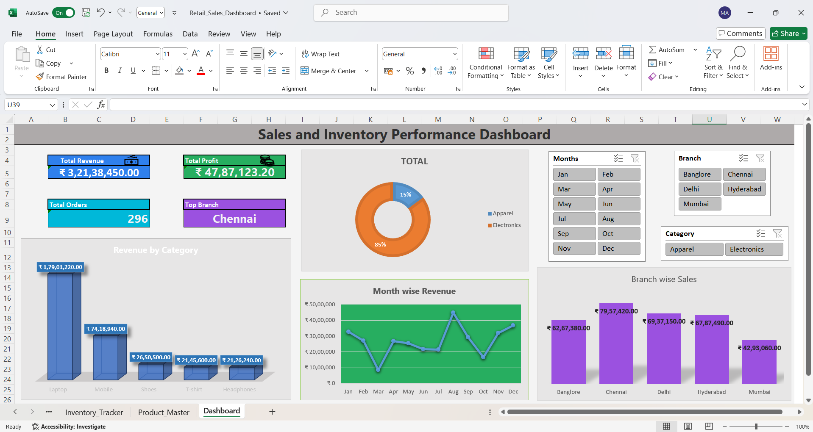
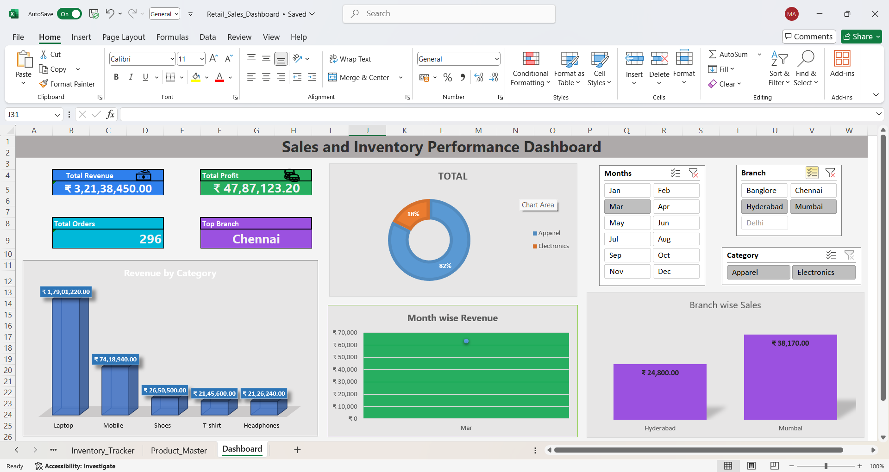
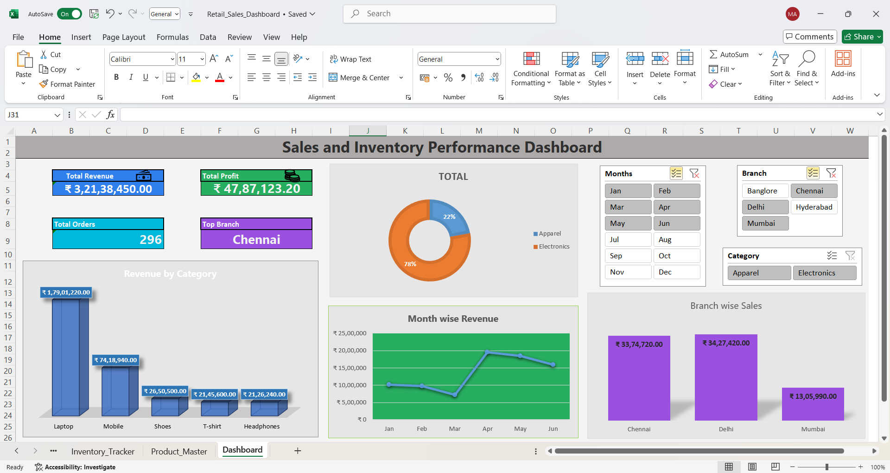

# Retail Sales Dashboard in Excel

This project presents a **Professional Retail Sales and Inventory Dashboard** built using **Advanced Excel** features. It showcases real-time sales analysis with dynamic charts, KPIs, slicers, and formatting—ideal for business insights and perfect to demonstrate Excel proficiency in interviews and portfolios.

---

## **Features**

- **KPI Cards** for:
  - Total Revenue
  - Total Profit
  - Total Orders
  - Top Performing Branch
- **Interactive Charts**:
  - Revenue by Category (3D Column)
  - Total Category Sales (Donut Chart)
  - Month-wise Revenue Trend (Line Chart)
  - Branch-wise Sales (2D Column)
- **Dynamic Slicers** to filter by:
  - Month
  - Branch
  - Category
- **Attractive Layout** with professional formatting and color schemes

---

## **Screenshots**

1. **Dashboard Overview**
   

2. **Filtered View: Hyderabad & Mumbai - March**
   

3. **Filtered View: Chennai, Delhi & Mumbai - Jan to June**
   

---

## **Usage**

- Open the Excel file and navigate to the **Dashboard** tab.
- Use the slicers to dynamically filter data by **month**, **branch**, and **category**.
- Hover over charts or review values to extract insights about sales trends and performance.

---

## **Skills Demonstrated**

- Advanced Excel Formulas
- Data Modeling with Tables
- Pivot Tables and Pivot Charts
- Dashboard Layout Design
- Slicers for Interactivity
- Professional Chart Formatting

---

## **Author**

**Mohammed Afroze Uddin**  
*Aspiring Data Analyst | Data Scientiest*

---

## **License**

This project is for educational and portfolio use. Feel free to fork or reference it with attribution.

